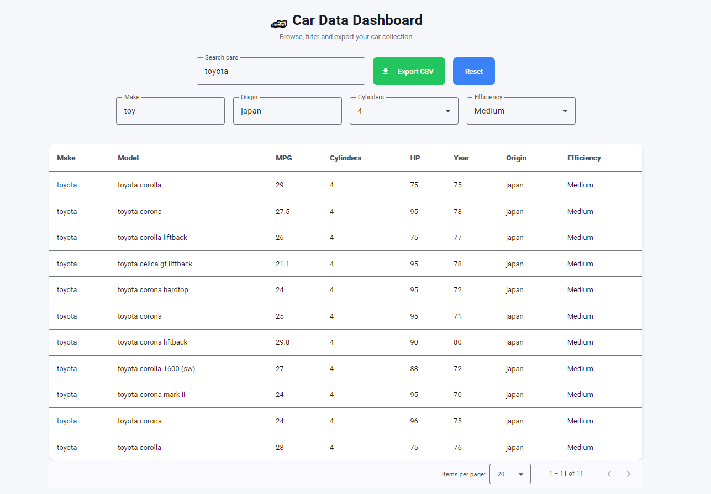

# FireHawk Systems - Car API Frontend Angular

<p align="center">
  
</p>

- This project was generated using [Angular CLI](https://github.com/angular/angular-cli) version 21.2.8.
- It is developed to work with [FireHawk Systems - Car API Backend](https://github.com/tutyamxx/FireHawk-backend)

## ⚙️ Installation

### Clone the project

```bash
git clone git@github.com:tutyamxx/FireHawk-frontend-angular.git
cd FireHawk-frontend-angular/
```

### Install dependencies

```bash
npm install
```

## ▶️ Running Locally

- Make sure you create a file in `environments/environment.ts` and paste the code from `environments/environment.example.ts` (This file is git ignored for security)

```bash
npm start
```

- Will fire it up on [http://localhost:4200/](http://localhost:4200/)

## ✨ Run prettier

```bash
npm run format
```

## ⚙️ Run production build

```bash
npm build
```

## Additional Resources

For more information on using the Angular CLI, including detailed command references, visit the [Angular CLI Overview and Command Reference](https://angular.dev/tools/cli) page.
